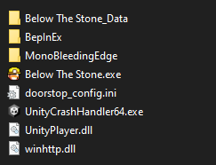

# Below The Stone Wiki Tools

Helper mod for Below The Stone to automatically extract game data.


## Development

This mod is based on BepInEx, a modding framework that allows multiple mods being loaded.
Furthermore, Harmony is used to patch into the game, which means no game code is distributed.

1. Download BepInEx from https://github.com/BepInEx/BepInEx/releases
2. Extract all files to your Below The Stone folder. It should look like this:\
   
3. Optional: start the game once. Afterwards you will see a config file in BepInEx/config/ called `BepInEx.cfg`. Open it and set `Enabled = true` under `[Logging.Console]` to see loaded mods and errors immediately.
4. Create a file called `Environment.props` in the root folder (one folder above the BelowTheStoneWiki.csproj file) and add the following content:
   ```xml
   <?xml version="1.0" encoding="utf-8"?>
   <Project ToolsVersion="Current" xmlns="http://schemas.microsoft.com/developer/msbuild/2003">
       <PropertyGroup>
           <BELOW_THE_STONE_INSTALL>C:/Program Files/Steam/steamapps/common/Below The Stone</BELOW_THE_STONE_INSTALL>
           <MOD_DEPLOYPATH>$(BELOW_THE_STONE_INSTALL)/BepInEx/plugins</MOD_DEPLOYPATH>
       </PropertyGroup>
   </Project>
   ```
5. Compile the project. This copies the resulting dll into the `MOD_DEPLOYPATH`, if set
